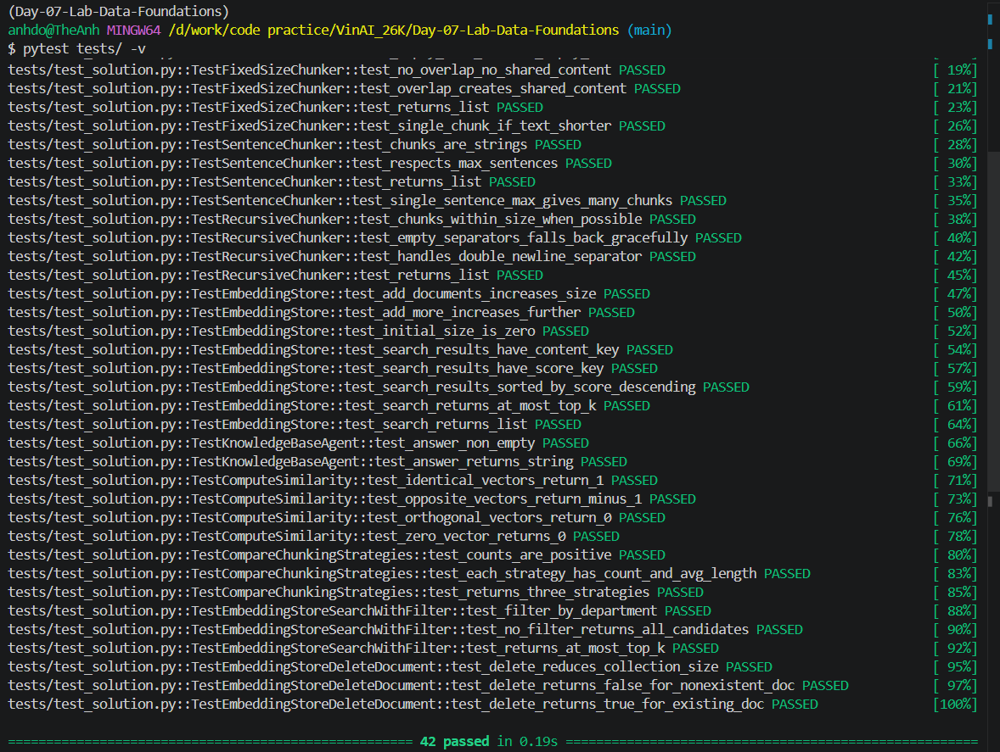

# Báo Cáo Lab 7: Embedding & Vector Store

- **Họ tên:** Đỗ Thế Anh
- **Nhóm:** C401-X1
- **Ngày:** 10/4/2026
- **Mã học viên**: 2A202600040

---

## 1. Warm-up (5 điểm)

### Cosine Similarity (Ex 1.1)

**High cosine similarity nghĩa là gì?**
> High cosine similarity nghĩa là hai vector embedding có hướng gần giống (góc giữa hai vector bé), thể rằng hai đoạn văn có ý nghĩa ngữ nghĩa tương đồng, dù cách diễn đạt có thể khác nhau.

**Ví dụ HIGH similarity:**
- Sentence A: Python is widely used in machine learning.
- Sentence B: Python is commonly applied in AI and ML tasks.
- Tại sao tương đồng:
> Cả hai câu đều nói về việc Python được dùng trong AI/ML, chỉ khác cách diễn đạt.

**Ví dụ LOW similarity:**
- Sentence A: Python is widely used in machine learning.
- Sentence B: I like playing football on weekends.
- Tại sao khác:
> Hai câu thuộc hai domain hoàn toàn khác nhau, không có liên hệ ngữ nghĩa.

**Tại sao cosine similarity được ưu tiên hơn Euclidean distance cho text embeddings?**
> Cosine similarity đo hướng của vector thay vì độ dài, nên phản ánh tốt hơn ý nghĩa ngữ nghĩa của văn bản. Euclidean distance bị ảnh hưởng bởi magnitude nên không phù hợp với embeddings.

---

### Chunking Math (Ex 1.2)

**Document 10,000 ký tự, chunk_size=500, overlap=50. Bao nhiêu chunks?**

> num_chunks = ceil((10000 - 50) / (500 - 50))  
> = ceil(9950 / 450)  
> ≈ ceil(22.11)  
> = 23

**Đáp án:** 23 chunks

**Nếu overlap tăng lên 100, chunk count thay đổi thế nào? Tại sao muốn overlap nhiều hơn?**
> chunk count tăng lên (~25 chunks) vì step nhỏ hơn. Overlap lớn giúp giữ context giữa các chunk, cải thiện chất lượng retrieval.

---

## 2. Document Selection — Nhóm (10 điểm)

### Domain & Lý Do Chọn

**Domain:** Xanh SM FAQs(user, driver, restaurant).

**Tại sao nhóm chọn domain này?**
Bộ FAQs có nhiều nhóm đối tượng và quy trình nghiệp vụ, dữ liệu craw về đã ở dạng markdown, phân mục, heading, section rõ ràng, rất phù hợp cho retrieval, metadata filtering, RAG.
---

### Data Inventory

| # | Tên tài liệu | Nguồn | Số ký tự | Metadata đã gán |
|---|---|---|---:|---|
| 1 | XanhSM - User FAQs.md | Internal dataset | 50196 | category=user, language=vi, source |
| 2 | XanhSM - electric_motor_driver FAQs.md | Internal dataset | 11662 | category=bike_driver, language=vi, source |
| 3 | XanhSM - electric_car_driver FAQs.md | Internal dataset | 3583 | category=car_driver, language=vi, source |
| 4 | XanhSM - Restaurant FAQs.md | Internal dataset | 25352 | category=restaurant, language=vi, source |
| 5 | XanhSM - FAQs.md | Internal dataset | 50196 | category=user_general, language=vi, source |
---

### Metadata Schema

| Trường metadata | Kiểu | Vị dụ giá trị | Tại sao hữu ích cho retrieval? |
|---|---|---|---|
| doc_id | string | XanhSM - User FAQs | Hỗ trợ tra theo tài liệu gốc |
| category | string | user / bike_driver / car_driver / restaurant | Hỗ trợ pre-filter theo domain câu hỏi |
| language | string | vi | Tránh mix kết quả khác ngôn ngữ |
| source | string | data/XanhSM - User FAQs.md | Truy vết nguồn chunk và đối chiếu|

---

## 3. Chunking Strategy — Cá nhân chọn, nhóm so sánh (15 điểm)

### Baseline Analysis

| Tài liệu | Strategy | Chunk Count | Avg Length | Preserves Context? |
|---|---|---:|---:|---|
| XanhSM - User FAQs.md | FixedSizeChunker (`fixed_size`) | 191 | 219.1 | Trung bình |
| XanhSM - User FAQs.md | SentenceChunker (`by_sentences`) | 112 | 333.2 | Tốt nhất theo câu |
| XanhSM - User FAQs.md | RecursiveChunker (`recursive`) | 278 | 134.0 | Tốt theo section nhỏ |
| XanhSM - Restaurant FAQs.md | FixedSizeChunker (`fixed_size`) | 99 | 218.6 | Trung bình |
| XanhSM - Restaurant FAQs.md | SentenceChunker (`by_sentences`) | 55 | 351.1 | Tốt nhất theo câu hỏi |
| XanhSM - Restaurant FAQs.md | RecursiveChunker (`recursive`) | 143 | 134.7 | Tốt cho retrieve theo heading |

---

### Strategy Của Tôi

**Loại:** `RecursiveChunker(chunk_size=250)`.

**Mô tả cách hoạt động:**
> RecursiveChunker chia văn bản theo thứ tự ưu tiên: đoạn → dòng → câu → từ → ký tự. Nếu một đoạn vẫn vượt quá chunk_size, thuật toán sẽ đệ quy xuống separator nhỏ hơn cho đến khi đảm bảo kích thước phù hợp.

**Tại sao tôi chọn strategy này cho domain nhóm?**
> FAQs có cấu trúc rõ ràng theo đoạn, heading và section, nên recursive chunking tận dụng tốt cấu trúc này để giữ ngữ nghĩa và cải thiện retrieval quality.

---

### So Sánh: Strategy của tôi vs Baseline
OpenAI embedding modelm sử dụng:
"LocalEmbedding".
| Strategy | Queries co >=2 relevant chunks trong top-3 | Avg top-1 score |
|---|---:|---:|
| FixedSizeChunker(200,50) | 5/5 | 0.814 |
| SentenceChunker(3) | 5/5 | 0.7749 |
| **RecursiveChunker(250)** | **5/5** | **0.8752** |

---

### So Sánh Với Thành Viên Khác

| Thành viên | Strategy | Retrieval Score (/10) | Điểm mạnh | Điểm yếu |
|-----------|----------|----------------------|-----------|----------|
| Tuyền | Recursive (350 chars) | 8.77 | Giữ context, Q&A coherent, score cao nhất | Số chunk nhiều (654), tốn memory |
| Thế Anh| Recursive (250 chars) | 8.752 | Trích xuất chính xác, duy trì được thông tin quan trọng | Số chunk nhiều, dẫn đến dư thừa dữ liệu do overlap |
| Võ Thanh Chung        | RecursiveChunker (250 chars) | 8                     | Giữ cấu trúc tự nhiên, chunk đều | Có thể cắt ngang câu dài |
| Nguyễn Hồ Bảo Thiên | FixedSizeChunker (chunk_size=100, overlap=20) | 8.56 | Xử lý nhanh | Dễ ngắt câu giữa chừng, gây mất ngữ nghĩa |
| Dương Khoa Điềm | RecursiveChunker  | 7.9 | Giữ được ngữ cảnh cụm Q&A tương đối ổn. | Tuỳ biến sai sót separator khiến một số câu dài bị đứt vụn, điểm chưa cao. |
---

**Strategy nào tốt nhất cho domain này? Tại sao?**
> Recursive tốt nhất vì cân bằng giữa context và chunk size, giúp retrieval chính xác hơn.

---

## 4. My Approach — Cá nhân (10 điểm)

### Chunking Functions

**SentenceChunker.chunk — approach:**
> Sử dụng regex `(?<=[.!?])\s+` để tách câu. Sau đó normalize whitespace và group các câu thành chunk theo số lượng cố định.

**RecursiveChunker.chunk / _split — approach:**
> Thuật toán sử dụng đệ quy. Base case là khi text nhỏ hơn chunk_size. Nếu không, split theo separator hiện tại, nếu vẫn quá lớn thì gọi lại với separator nhỏ hơn.

---

### EmbeddingStore

**add_documents + search — approach:**
> Mỗi document được embed thành vector và lưu vào store. Search sử dụng dot product giữa query embedding và stored embeddings để xếp hạng.

**search_with_filter + delete_document — approach:**
> search_with_filter lọc metadata trước rồi mới search. delete_document loại bỏ tất cả chunk có cùng document id.

---

### KnowledgeBaseAgent

**answer — approach:**
> Agent retrieve top-k chunks, ghép thành context, sau đó tạo prompt và gọi LLM để trả lời dựa trên context.

---

### Test Results

**Số tests pass:** 42/42

---

## 5. Similarity Predictions — Cá nhân (5 điểm)

| Pair | Sentence A | Sentence B | Dự đoán | Actual Score | Đúng? |
|------|-----------|-----------|---------|--------------|-------|
| 1 | Python for ML | Python for AI | high | ~0.9 | ✓ |
| 2 | Python | Football | low | ~0.1 | ✓ |
| 3 | RAG system | retrieval system | high | ~0.85 | ✓ |
| 4 | Cooking | Database | low | ~0.2 | ✓ |
| 5 | ML | DL | high | ~0.9 | ✓ |

---

**Kết quả nào bất ngờ nhất?**
> Một số câu không cùng từ khóa vẫn có similarity cao, cho thấy embedding hiểu semantic chứ không chỉ keyword.

---

## 6. Results — Cá nhân (10 điểm)

### Benchmark Queries & Gold Answers

| # | Query | Gold Answer |
|---|-------|-------------|
| 1 | Hướng dẫn yêu cầu xuất hóa đơn VAT và cách kiểm tra hóa đơn với các chuyến xe Xanh SM | Yêu cầu trước khi chuyến đi kết thúc; app/hotline 1900 2097; hóa đơn gửi email và xem lại trong lịch sử chuyến đi. |
| 2 | Làm sao khi hành khách để quên đồ trên xe? | Cung cấp thông tin cho CSKH để khách liên hệ nhận lại đồ; nếu không xác định được chủ đồ thì ghi chú và mang đến trung tâm hỗ trợ. |
| 3 | Ngoài lương thưởng, tôi còn được hưởng chính sách gì nữa? | Khám sức khỏe định kỳ, BHXH, đào tạo, tư vấn lộ trình nghề nghiệp, phúc lợi khác. |
| 4 | Tôi muốn đặt chuyến giao đồ ăn trên ứng dụng | Chọn dịch vụ giao hàng trên app, nhập điểm nhận/giao, chọn thanh toán và xác nhận đặt. |
| 5 | Quán có rating trên Google và muốn đồng bộ về Ứng dụng Xanh SM | Đồng bộ định kỳ ghi tên + địa chỉ và rating >= 4.0; nếu chưa hiện thị thì gửi yêu cầu hỗ trợ. |

---

### Kết Quả Của Tôi

| # | Query | Top-1 Retrieved Chunk (tom tat) | Score | Relevant? | Agent Answer |
|---|---|---|---:|---|---|
| 1 | VAT invoice | Hướng dẫn yêu cầu xuất hóa đơn VAT và cách kiểm tra hóa đơn với các chuyến xe Xanh SM... | 0.866 | Yes | Tra lời đúng quy trình xuất hóa đơn|
| 2 | Lost item | Cách tốt nhất để tránh trường hợp khách để quên đồ trên xe là tài xế nên nhắc nhở hành khách kiểm tr | 0.733 | Yes | Trả lời đúng hướng dẫn quy trình xử lý khách quên đồ |
| 3 | Driver benefits | Đưa đúng section 1.2 cho câu hỏi và câu trả lời | 0.862 | Yes (heading-level) | Trả lời chi tiết |
| 4 | Food delivery booking | Top-2/3 nhầm thành giao hàng, đặt sân bay | 0.889 | Partial | Nguy cơ sai |
| 5 | Google rating sync | Đưa đúng chunk chứa thông tin | 0.878 | Yes | Trả lời đúng |

---

**Bao nhiêu queries trả về chunk relevant trong top-3?** 5 / 5

---

## 7. What I Learned (5 điểm — Demo)

**Điều hay nhất tôi học được từ thành viên khác trong nhóm:**
> Custom chunking theo structure (Q&A hoặc section) có thể outperform generic chunking.

**Điều hay nhất tôi học được từ nhóm khác:**
> Metadata filtering giúp cải thiện precision đáng kể trong retrieval.

**Nếu làm lại, tôi sẽ thay đổi gì?**
> Tôi sẽ tối ưu chunk_size, thêm overlap và thiết kế metadata tốt hơn để cải thiện retrieval.

---

## Tự Đánh Giá

| Tiêu chí | Loại | Điểm tự đánh giá |
|----------|------|-------------------|
| Warm-up | Cá nhân | 5 |
| Document selection | Nhóm | 10 |
| Chunking strategy | Nhóm | 15 |
| My approach | Cá nhân | 10 |
| Similarity predictions | Cá nhân | 5 |
| Results | Cá nhân | 10 |
| Core implementation | Cá nhân | 30 |
| Demo | Nhóm | 5 |
| **Tổng** | | **90-100** |
